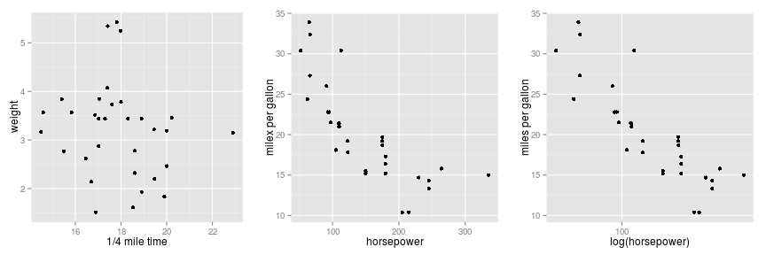

<section>
    <h2 style="color:cyan">Linear Regression Explorer</h2>
    <h4>An Interactive Application to Develop Your Intuition of Linear Regression</h4>
    <h5 style="font-size:0.6em; padding-top:4em">Uwe Neuhaus</h5>
    <h6 style="font-size:0.6em">Data Wrangler</h6>
</section>

---
<section>
    <h2 style="color:cyan">The Aim</h2>
    <ul>
      <li class="fragment fade-in">Develop a better intuition for linear regression.</li>
      <li class="fragment fade-in">Explore the linear relationship between various variables.</li>
      <li class="fragment fade-in">Try to find the regression line interactively by hand.</li>
      <li class="fragment fade-in">Compare your own estimates with the true regression line.</li>
      <li class="fragment fade-in">Implementation as an online application (using Shiny)</li>
    </ul>
</section>

---

## Selecting the Variables

- Different variables from the mtcars data set can be selected for the x- and y-axis.
- The x-axis can be scaled (logarithmic, squared, cubed).  
  

---

## Try to Manually Fit the Line

- The aim is to fit a regression line manually by interactively choosing the intersect and slope.
- To evaluate the selected values, the residual standard error is calculated and displayed.
  

Residual Standard Error: 5.4402930

---

## Compare with True Regression Line

- You can compare your own estimate with the true linear regressionn line.
- The minimal residual standard error and R-sqared can be displayed if desired.
  

Residual standard error: 5.4402930

Minimal residual standard error: 3.1340226

R-squared: 0.4594304
